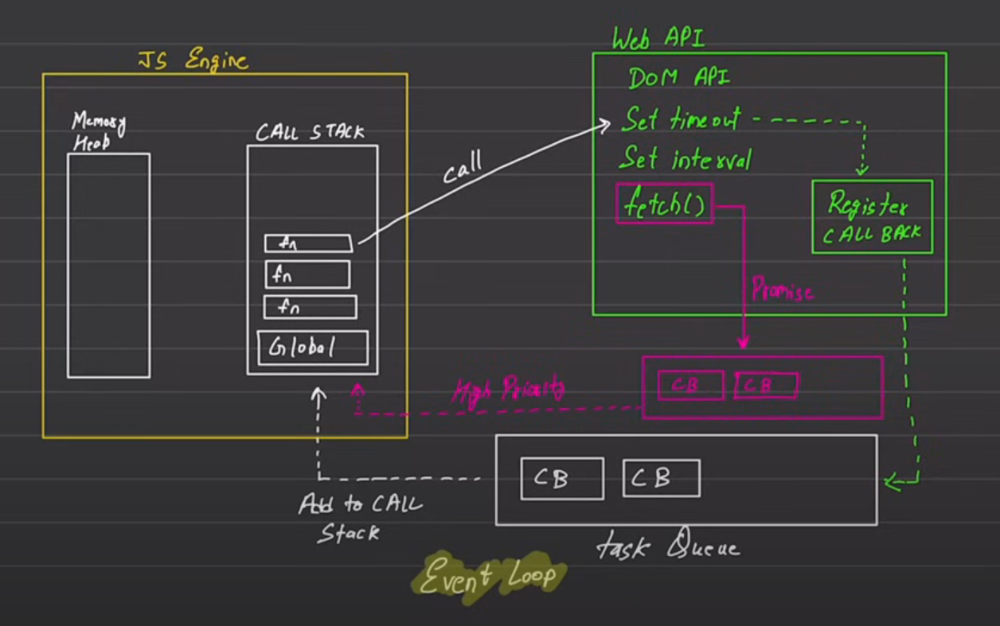

# Default Javascript Behaviour
- Synchronous
- Single Threaded

# Execution Context
executes one line of code at a time
- console log -1
- console log -2
each operation waits for the last one to complete before executing

### Blocking code vs non-blocking code
Blocking code blocks the flow of the program (Read File Sync)
Non-Blocking code doesn't block execution (Read File Async)

