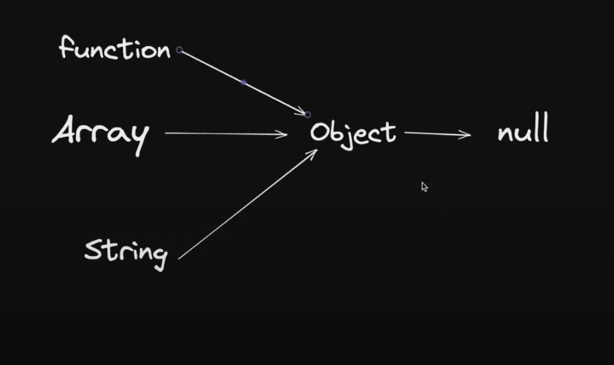
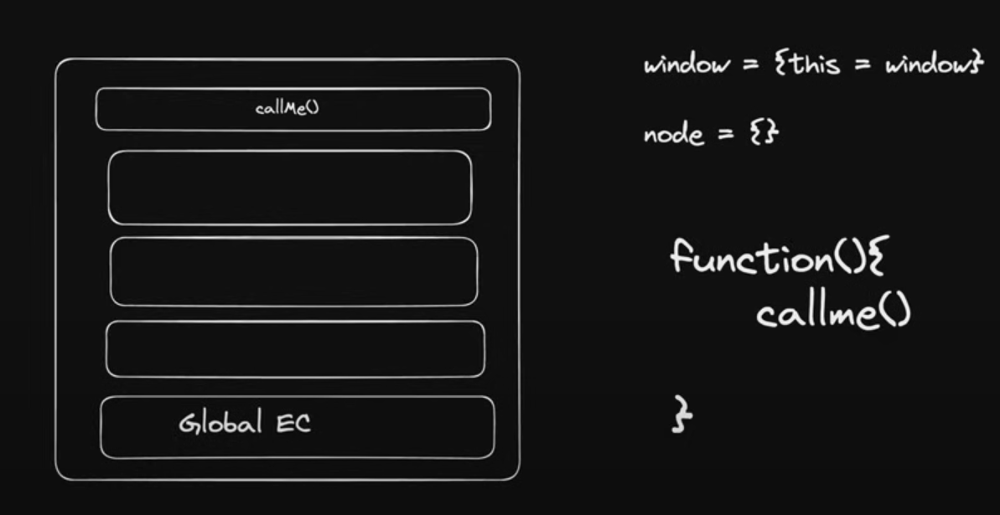

# javascript and classes

## OOP

## Object
- collection of properties and methods
- toLowerCase

## why use OOP

## parts of OOP
Object literal

- Constructor function
- Prototypes
- Classes
- Instance (new, this)

# new keyword
- new keyword generates an empty object
- new keyword calls Constructor function 
- arguments gets injected in 'this' 
- we got the object

## 4 pillars
Abstraction
Encapsulation
Inheritance
Polymorphishm

# Prototypes and objects

# Call
